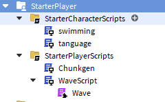
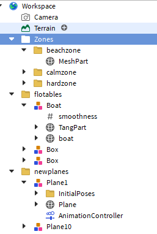

# Roblox Ocean Generation

This project aims to create a dynamic and immersive ocean environment in Roblox, combining realistic wave animations, physical interactions with water, and underwater visual effects. You can play the showcase here [https://www.roblox.com/games/15349326264/Ocean-Showcase](https://www.roblox.com/games/15349326264/Ocean-Showcase)

## Table of Contents

- [Blender](#blender)
  - [Bones Creation](blender/README.md)
- [Materials](materials/README.md)
- [Studio](#studio)
  - [StarterPlayer](#starterplayer)
    - [StarterCharacterScripts](studio/StarterPlayer/StarterCharacterScripts/README.md)
    - [StarterPlayerScripts](studio/StarterPlayer/StarterPlayerScripts/README.md)
  - [Workspace](studio/Workspace/README.md)

---

## Project Steps

### 1. Bone Generation in Blender
The Python script [`bonesCreation.py`](blender/bonesCreation.py) is used to automatically generate armatures (bones) on a plane in Blender. These bones act as control points for wave animations in Roblox. Steps include:
- Creating a plane in Blender.
- Running the script to generate bones aligned with the plane's vertices.
- Exporting the model with bones to Roblox.

For more details, see the [Blender README](blender/README.md).

---

### 2. Texture Creation
Textures (normal maps and color maps) are generated in Blender using noise applied to a plane. These textures are used to give the water a realistic appearance in Roblox. The files are organized in the [materials](materials/README.md) folder.

---

### 3. Integration in Roblox Studio
The integration in Roblox Studio relies on a well-structured hierarchy of scripts to manage animations, physical interactions, and visual effects.

#### Script Hierarchy

##### **1. Wave Animation Scripts**
- **[`Wave.luau`](studio/StarterPlayer/StarterPlayerScripts/Wave.luau)**: Implements mathematical models (Gerstner and FFT) to simulate waves.
- **[`WaveScript.luau`](studio/StarterPlayer/StarterPlayerScripts/WaveScript.luau)**: Manages the initialization and updates of waves for multiple water planes.

##### **2. Dynamic Generation Scripts**
- **[`ChunkGeneration.luau`](studio/StarterPlayer/StarterPlayerScripts/ChunkGeneration.luau)**: Dynamically repositions water planes around the player to create the illusion of an infinite ocean.

##### **3. Physical Interaction Scripts**
- **[`Pitching.luau`](studio/StarterPlayer/StarterCharacterScripts/Pitching.luau)**: Adjusts the orientation and position of floating objects based on wave movements.
- **[`Swimming.luau`](studio/StarterPlayer/StarterCharacterScripts/Swimming.luau)**: Handles swimming mechanics and underwater visual effects.

##### **4. Visual Animation Scripts**
- **[`AnimPlane.luau`](studio/Workspace/AnimPlane.luau)**: Animates water materials to simulate rippling effects.

---

## Overall Workflow

1. **Initialization**:
   - Water planes are loaded and configured with bones and textures.
   - Animation and generation scripts are initialized.

2. **Wave Animation**:
   - Waves are calculated in real-time using mathematical models.
   - Bones of water planes are moved to reflect wave patterns.

3. **Physical Interactions**:
   - Floating objects dynamically respond to wave movements.
   - Players can swim with immersive animations and visual effects.

4. **Optimization**:
   - Water planes are dynamically repositioned to minimize resource usage.
   - Animations are calculated only for planes near the player.

---

## Conclusion

This project combines powerful tools like Blender and Roblox Studio to create a realistic ocean experience. Each component, from textures to scripts, plays a key role in delivering this immersive environment.